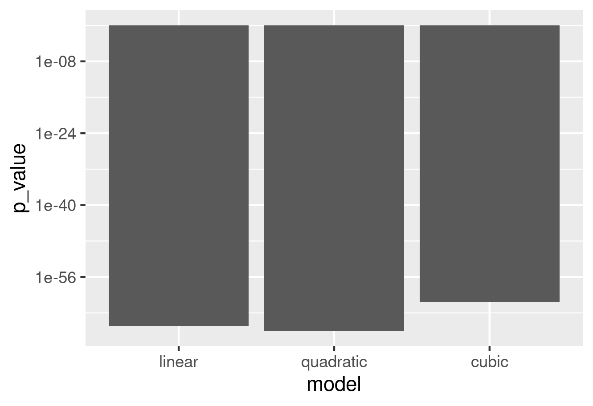

# skat_question_1

Branch   |
---------|-------------------------------------------------------------------------------------------------------------------
`master` | 
`develop`|

Question about the SKAT R package.

 * Code: [script.R](script.R)
 * Video: [YouTube](https://youtu.be/6Tmd6Y0RN-w) [download (.ogv)](http://richelbilderbeek.nl/skat_question_1.ogv)

In this code, I simulate the phenotype, directly based on the 
genotype (i.e. no covariates), in three ways:

 * `linear`: Phenotype is the sum of minor SNPs
 * `quadratic`: Phenotype is the square of sum of minor SNPs
 * `cubed`: Phenotype is the cube of sum of minor SNPs

From that, I let SKAT estimate if 
Why can SKAT fit a linear null model to the `quadratic` best?

